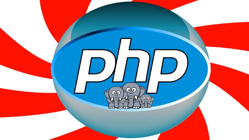

## Aim 🏹
- Recap of PHP Fundamentals
  - Using PHP in HTML
  - Variables
  - Operators
  - Conditionals
  - Iterable blocks(loops)
  - Printing out text
  - Arrays

- We will work on County mix, you are encouraged to look at the other recaps (HTML/CSS/JS)

#### @Credits
- [Image](https://img-a.udemycdn.com)

> "He is no fool who gives up what he cannot keep to gain what he cannot loose" _Jim Elliot_